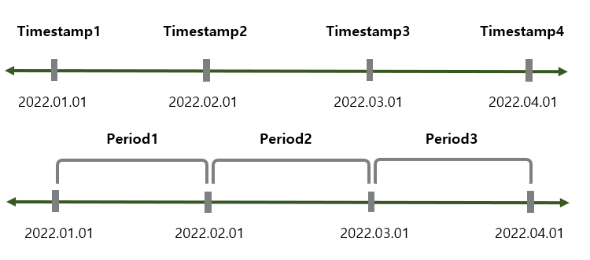

# 데이터 사전 처리

## 1. 누락 데이터 처리

### 1) 누락 데이터 개수

- `df['deck'].value_counts(dropna=False)` : 누락 데이터의 개수를 확인하려면 반드시 `dropna=False` 옵션을 사용해야 함(그렇지 않으면 NaN값을 제외한 유효한 데이터의 개수만을 구함).
- `df['deck'].isnull()` : 누락 데이터면 True를 반환하고, 유효한 데이터가 존재하면 False를 반환
  - `df['deck'].isnull().sum(axis=0)`: 누락 데이터 개수를 구하긴 위해선 `sum(axis=0)`을 이용해야 함.
- `df['deck'].notnull()` : 누락 데이터면 False를 반환하고, 유효한 데이터가 존재하면 True를 반환

### 2) 누락 데이터 제거

- ` df.dropna(axis=1, thresh=500)` : NaN 값이 500개 이상인 열을 모두 삭제
  - `axis=0(index)`은 행을 따라 동작하고, `axis=1(columns)`은 열을 따라 동작함.
- `df.dropna(subset=['age'], how='any', axis=0)` : 'age' 열의 행 중에서 NaN 값이 하나라도 있는 모든 행을 삭제
- `df.dropna(subset=['age'], how='all', axis=0)` : 'age' 열의 행 중에서 모든 데이터가 NaN 값일 경우에만 삭제

### 3) 누락 데이터 치환

- **평균으로 누락 데이터 치환**

  ```python
  mean_age = df['age'].mean(axis=0)
  df['age'].fillna(mean_age)
  ```
  
- **가장 많이 나타나는 값으로 치환**

  ```python
  most_freq = df['age'].value_counts(dropna=True).idmax()
  ```

- **이웃하고 있는 값으로 바꾸기**

  ```python
  df['age'].fillna(method='ffill')
  ```

<br>

## 2. 중복 데이터 처리

### 1) 중복 데이터 확인

- `df.duplicated()` : 각 행의 중복 여부를 나타내는 불린 시리즈로 반환
  - 중복일 경우 True, 중복이 아닐 경우 False
  - 처음 나오는 행에 대해서는 False를 반환

### 2) 중복 데이터 제거

- `df.drop_duplicates(subset=['c1', 'c2'])` : 'c1', 'c2' 열을 기준으로 판별해 중복되는 데이터를 삭제
  - 중복된 값 중 처음 나타난 것은 삭제되지 않음.

<br>

## 3. 범주형(카테고리) 데이터 처리

### 1) 구간 분할

- `count, bin_dividers = np.histogram(df['age'], bins=3)` 
  - 나누려는 구간(bin) 개수를 bins 옵션에 입력하면 각 구간에 속하는 값의 개수(count)와 경계값 리스트(bin_dividers)를 반환
- `df['age_bin'] = pd.cut(x=df['age'], bins=bin_dividers, labels=age_names, include_lowest=True)` 
  - `pd.cut()` 함수로 각 데이터를 3개의 bin에 할당
  - `include_lowest=True`를 사용하면 각 구간의 낮은 경계값을 포함

### 2) 더미 변수

- 범주형 데이터를 회귀분석 등 머신러닝 알고리즘에 바로 사용할 수 없는 경우, 더미 변수를 만들어 컴퓨터가 인식 가능하도록 함.

- `pd.get_dummies()` 함수를 사용해 범주형 변수의 모든 고유값을 각각 새로운 더미 변수로 변환할 수 있음.
- 더미가 변수가 본래 속해 있던 행에는 1이 입력되고, 속하지 않았던 다른 행에는 0이 입력됨.

### 3) 원핫인코딩

```python
from sklearn import preprocessing

# 전처리를 위한 encoder 객체 만들기
label_encoder = preprocessing.LabelEncoder()   # label encoder 생성
onehot_encoder = preprocessing.OneHotEncoder() # one hot encoder 생성

# label encoder로 문자열 범주를 숫자형 범주로 변환
onehot_labeled = label_encoder.fit_gransform(df['age'].head(15))

# 2차원 행렬로 변경
onehot_reshaped = onehot_labeled.reshape(len(onehot_labeled), 1)

# 희소행렬로 변환
onehot_fitted = onehot_encoder.fit_transform(onehot_reshaped)
```

- **희소행렬**(sparse matrix): 행렬의 값이 대부분 0인 경우

<br>

## 4. 시계열 데이터

- `Timestamp` : 특정한 시점을 기록
- `Period` : 두 시점 사이의 일정한 기간을 기록



### 1) 다른 자료형을 시계열 객체로 변환

- `ts_dates = pd.to_datetime(df['Date'])` : 문자열을 Timestamp로 변환

- `ts_dates.to_period(freq='D')` : Timestamp를 Period로 변환

  더 많은 freq 옵션 :point_right: [freq 옵션](https://pandas.pydata.org/pandas-docs/stable/user_guide/timeseries.html)

### 2) 시계열 데이터 만들기

- **timestamp 배열**: 여러 개의 날짜가 들어 있는 배열 형태의 시계열 데이터
  
  ```python
  # pd.date_range()
  ts_ms = pd.date_range(start='2022-06-20', # 날짜 범위 시작
                       end='None',          # 날짜 범위 끝
                       periods=6,           # 생성할 Timestamp 개수
                       freq='MS',           # 시간 간격(MS: 월의 시작일)
                       tz='Asia/Seoul')     # 시간대(timezone)
  
- **period 배열**: 여러 개의 기간이 들어 있는 시계열 데이터

  ```python
  #.pd.period_range()
  pr_m = pd.period_range(start='2022-06-20',
                        end='None',
                        periods=3,
                        freq='M')
  ```

### 3) 시계열 데이터 활용

- **날짜 데이터 분리**

  `df['Date'].dt.year`, `df['Date'].dt.month`, `df['Date'].dt.day` 

<br>

# [참고 자료]

- 오승환, 『파이썬 머신러닝 판다스 데이터 분석』, 정보문화사(2019), p.172-215
