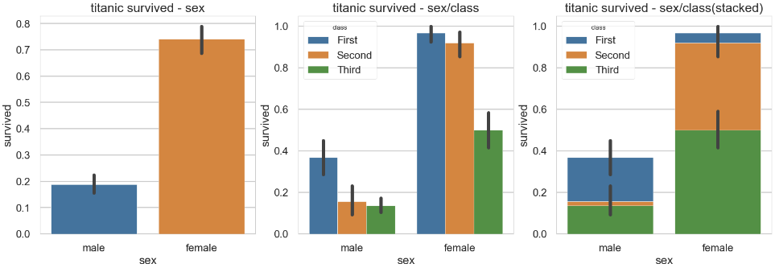
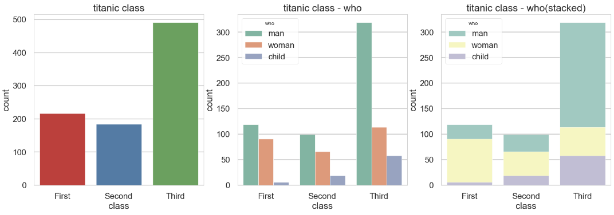

# Seaborn 라이브러리 - 고급 그래프 도구

## 1. regplot()

- **회귀선이 있는 산점도**

  - 서로 다른 2개의 연속 변수 사이의 산점도를 그리고 선형회귀분석에 의한 회귀선을 함께 나타냄.
  
  ```python
  # 그래프 그리기 - 선형회귀선 표시
  sns.regplot(x='age',     # x축 변수
             y='fare',     # y축 변수
             data=titanic, # 데이터
             ax=ax1)       # axe 객체 - 1번째 그래프
  
  # 그래프 그리기 - 선형회귀선 미표시
  sns.regplot(x='age',
             y='fare',
             data=titanic,
             ax=ax2,
             fit_reg=False) # 회귀선 미표시
  ```

<br>

## 2. distplot()

- **히스토그램과 커널 밀도 함수 그래프**

  - **커널 밀도 함수:** 그래프와 x축 사이의 면적이 1이 되도록 그리는 밀도 함수 분포

  - 단변수 데이터의 분포를 확인할 때 사용함.

  ```python
  fig = plt.figure(figsize=(15, 5))
  ax1 = fig.add_subplot(1, 3, 1)
  ax2 = fig.add_subplot(1, 3, 2)
  ax3 = fig.add_subplot(1, 3, 3)
  
  # distplot()
  sns.distplot(titanic['fare'], ax=ax1)
  
  # kedplot()
  sns.kedplot(x='fare', data=titanic, ax=ax2)
  
  # histplot
  sns.hisplot(x='fare', data=titanic, ax=ax3)
  ```

<br>

## 3. heatmap()

- 2개의 범주형 변수를 각각 x축, y축에 넣고 데이터를 매트릭스 형태로 분류
- 데이터프레임을 피벗테이블로 정리할 때는 한 변수를 행 인덱스로, 나머지 변수를 열 이름으로 설정

  ```python
  table = titanic.pivot_table(index=['sex'], columns=['class'], aggfunc='size')
  
  sns.heatmap(table,              # 데이터프레임
             annot=True, fmt='d', # 데이터 값 표시 여부, 정수형 포맷
             cmap='YlGnBu',       # 컬러맵
             linewidth=.5,        # 구분선
             cbar=False)          # 컬러바 표시 여부
  ```

  - `aggfunc='size'`는 데이터 값의 크기를 기준으로 집계한다는 뜻

<br>

## 4. stripplot()/swarmplot()

- 범주형 데이터의 산점도

- **stripplot()**

  ```python
  # 이산형 변수의 분포 - 데이터 분산 미고려(중복 표시 O)
  sns.stripplot(x='class',
               y='age',
               data=titanic,
               ax=ax1)
  ```

- **swarmplot()**

  - 데이터의 분산까지 고려하여, 데이터가 퍼져 있는 정도를 입체적으로 볼 수 있음.
  
  ```python
  # 이산형 변수의 분포 - 데이터 분산 고려(중복 표시 X)
  sns.swarmplot(x='class',
               y='age',
               data=titanic,
               ax=ax2)
  ```

<br>

## 5. barplot()

```python
# x축, y축 변수 할당
sns.barplot(x='sex', y='survived', data=titanic, ax=ax1)

# x축, y축에 변수 할당하고 hue 옵션 추가
sns.barplot(x='sex', y='survived', hue='class', data=titanic, ax=ax2)

# x축, y축에 변수 할당하고 hue 옵션 추가하여 누적 출력
sns.barplot(x='sex', y='survived', hue='class', dodge=False, data=titanic, ax=ax3)
```


- `dodge=False` 옵션은 누적해서 출력, `dodge=Ture`가 기본 옵션임.

- `dodge=False`를 사용함으로써 구성비를 확인할 수 있음.

<br>

## 6. countplot()

- 빈도 그래프

  ```python
  sns.countplot(x='class', palette='Set1', data=titanic, ax=ax1)
  sns.countplot(x='class', hue='who', palette='Set2', data=titanic, ax=ax2)
  sns.countplot(x='class', hue='who', palette='Set3', dodge=False, data=titanic, ax=ax3)
  ```

  

  - `dodge=False` 옵션 추가(축 방향으로 분리하지 않고 누적 그래프 출력)

<br>

## 7. boxplot()/violinplot()

- **boxplot()**

  - 범주형 데이터 분포와 주요 통계 지표를 함께 제공

  ```python
  # 박스 플롯 - 기본값
  sns.boxplot(x='alive', y='age', data=titanic, ax=ax1)
  
  # 박스 플롯 - hue 변수 추가
  sns.boxplot(x='alive', y='age', hue='sex', data=titanic, ax=ax2)
  ```

- violinplot()

  ```python
  # 바이올린 그래프 - 기본값
  sns.violinplot(x='alive', y='age', data=titanic, ax=ax3)
  
  # 바이올린 그래프 - hue 변수 추가
  sns.violinplot(x='alive', y='age', hue='sex', data=titanic, ax=ax4)
  ```

<br>

## 8. jointplot()

- 산점도를 기본을 표시하고, x-y축에 각 변수에 대한 히스토그램을 동시에 보여줌.

- 두 변수의 관계와 데이터가 분산되어 있는 정도를 한눈에 파악하기 좋음.

  ```python
  # 조인트 그래프 - 산점도(기본값)
  j1 = sns.jointplot(x='fare', y='age', data=titanic)
  
  # 조인트 그래프 - 회귀선
  j2 = sns.jointplot(x='fare', y='age', kind='reg', data=titanic)
  
  # 조인트 그래프 - 육각 그래프
  j3 = sns.jointplot(x='fare', y='age', kind='hex', data=titanic)
  
  # 조인트 그래프 - 커널 밀집 그래프
  j4 = sns.jointplot(x='fare', y='age', kind='kde', data=titanic)
  ```

<br>

## 9. FaceGrid()

- 행, 열 방향으로 서로 다른 조건을 적용해 여러 개의 서브 플롯을 만듦.

- 각 서브 플롯에 적용할 그래프 종류를 `map()` 메소드를 이용해 그리드 객체에 전달

  ```python
  # 조건에 따라 그리드 나누기
  g = sns.FacetGrid(data=titanic, col='who', row='survived')
  
  # 그래프 적용하기
  g = g.map(plt.hist, 'age')
  ```

<br>

## 10. pairplot()

- 이변수 데이터의 분포

- 인자로 전달되는 데이터프레임의 열(변수)을 두 개씩 짝을 지을 수 있는 모든 조합에 대해 표현

- 같은 변수끼리 짝을 이루는 대각선 방향으로는 **히스토그램**을 그리고 서로 다른 변수 간에는 **산점도**를 그림.

  ```python
  # titanic 데이터셋 중에서 분석 데이터 선택하기
  titanic_pair = titanic[['age', 'pclass', 'fare']]
  
  # 조건에 따라 그리드 나누기
  g = sns.pairplot(titanic_pair)
  ```

<br>

# [참고 자료]

- 오승환, 『파이썬 머신러닝 판다스 데이터 분석』, 정보문화사(2019), p.147-160